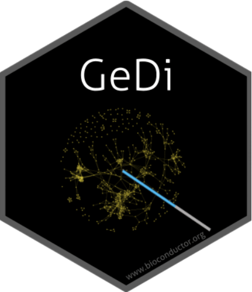

<!-- README.md is generated from README.Rmd. Please edit that file -->

```{r, include = FALSE}
knitr::opts_chunk$set(
  collapse = TRUE,
  comment = "#>",
  fig.path = "man/figures/README-",
  out.width = "100%"
)
```

# GeDi

<a href="https://doi.org/10.1186/s12859-021-04461-5"><a>


<!-- badges: start -->
[](https://github.com/AnnekathrinSilvia/GeDi/actions)
[](https://bioconductor.org/checkResults/devel/bioc-LATEST/GeneTonic/)
[](https://github.com/AnnekathrinSilvia/GeDi/commits/devel)
[](https://www.tidyverse.org/lifecycle/#stable)
[](https://codecov.io/github/AnnekathrinSilvia/GeDi)
<!-- badges: end -->

The goal of GeDi is to ...

## Installation

You can install the development version of GeDi from [GitHub](https://github.com/AnnekathrinSilvia/GeDi) with:

```{r, eval = F}
install.packages("devtools")
devtools::install_github("AnnekathrinSilvia/GeDi")
```

## Example

If you want to give GeDi a testrun on a demo dataset, you can simply launch the Shiny application and load the demo data in the **Data input** panel. To start the Shiny Application, you can use the following code:

```{r, eval = F}
library("GeDi")
GeDi()
```

## Usage Overview

You can find the rendered version of the documentation of `GeDi` at the project website                            https://AnnekathrinSilvia.github.io/GeDi, created with `pkgdown`.                            


## Development

If you encounter a bug, have usage questions, or want to share ideas and functionality to make this package better, feel free to file an [issue](https://github.com/AnnekathrinSilvia/GeDi/issues).

## Code of Conduct
  
Please note that the GeDi project is released with a [Contributor Code of Conduct](https://contributor-covenant.org/version/2/1/CODE_OF_CONDUCT.html). By contributing to this project, you agree to abide by its terms.

## License

MIT &copy; Annekathrin Silvia Nedwed
