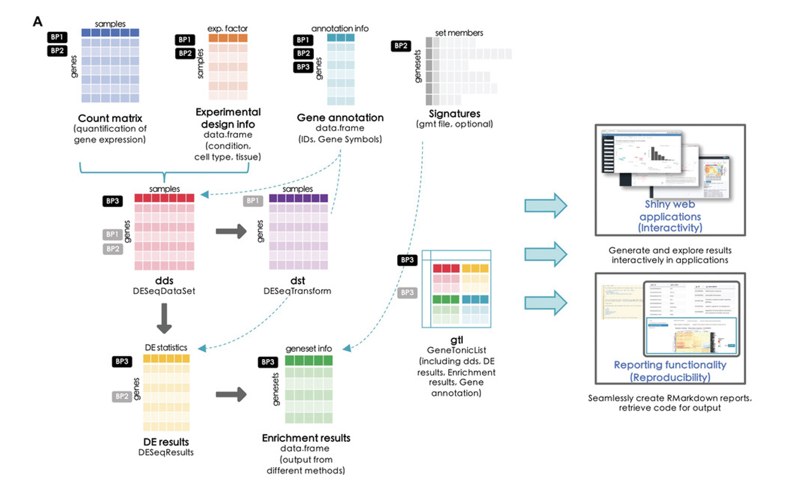

# Welcome to `GeDi`!

[`GeDi`](https://github.com/AnnekathrinSilvia/GeDi) is an R package containing a Shiny application for analyzing the results of a functional annotation analysis. This enables an interactive exploration of the results and hence a better understanding of the underlying mechanisms in the dataset at hand.  This enables an interactive and at the same time analysis, keeping the functionality accessible, and yet providing a comprehensive selection of graphs and tables to mine the dataset at hand.

`GeDi` is an R package which fully leverages the infrastructure of the Bioconductor project in order to deliver an interactive yet reproducible exploration of enrichment analysis results. Graphs, tables, and interactive HTML reports can be readily exported and shared across collaborators. The dynamic user interface displays a broad level of content and information, subdivided by thematic tasks. All in all, it aims to enforce a proper exploration, by reaching out both life scientists and experienced bioinformaticians, and also fosters the communication between the two sides, offering high quality visualizations and high standard of accessible documentation.

The application is structured to simplify and summarize the often overwhelming amount of information provided by enrichment results which oftentimes are saved in an exuberant long list of enriched genesets. `GeDi` aims to summarize this list in a variety of different visualization and analyses. `GeDi` stands for Geneset-Distances, which is the overarching topic of the application at hand. In `GeDi` the list of enriched terms is used as input and several different approaches are used in order to summarize the data and identify patterns and pathways in the data. For this purpose, `GeDi` uses different distance measurements to determine the distance between the individual genesets of the input. Based on these distances of the input data, clustering approaches are applied to identify larger clusters, patterns and overall themes in the data at hand. This reduces heavily the size of the input data and hence facilitates the interpretation of the data. It also helps to generate hypotheses about the data and influence future analyses. 

# How to get started

If you want to use `GeDi`, you simply need one input: the results of a functional annotation analysis such as an enrichment analysis result calculated with [`topGO`](http://bioconductor.org/packages/release/bioc/html/topGO.html) or [`clusterProfiler`](http://bioconductor.org/packages/release/bioc/html/clusterProfiler.html). Ideally, `GeDi` is used as an additional step in an RNA-seq analysis. It integrates perfectly into the repertoire of Bioconductor packages developed in our group for RNA-sequencing analysis such as   
[`pcaExplorer`](http://bioconductor.org/packages/release/bioc/html/pcaExplorer.html), [`ideal`](http://bioconductor.org/packages/release/bioc/html/ideal.html) and [`GeneTonic`](http://bioconductor.org/packages/release/bioc/html/GeneTonic.html). We described the usgae and workflow of these packages for RNA-seq in our paper [`Interactive and Reproducible Workflows for Exploring and Modeling RNA-seq Data with pcaExplorer, Ideal, and GeneTonic`](https://doi.org/10.1002/cpz1.411). The general workflow of the paper is visualized in the following figure, which can also be found as part of Figure 1 in our paper. 

`GeDi` can be included in this workflow as an additional step besides `GeneTonic` and is especially suited for the exploration of the enrichment results. 
The workflow to generate and prepare the enrichment results can be found in our linked paper or in detail in the vignette of this paper. A short summary is shown below. 

